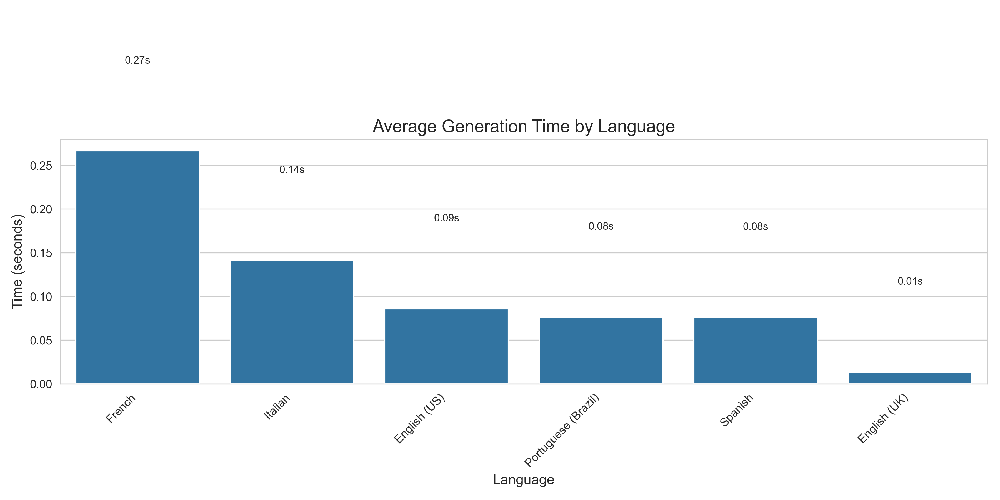
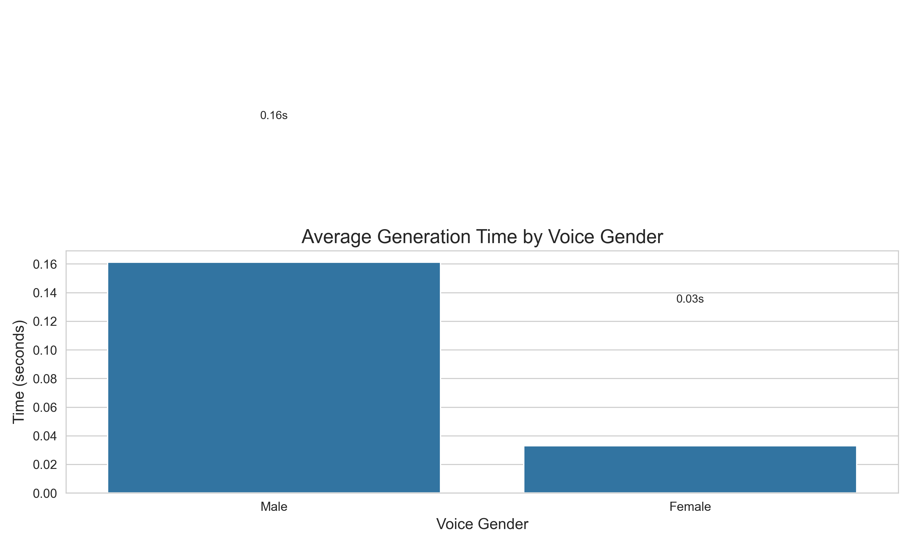
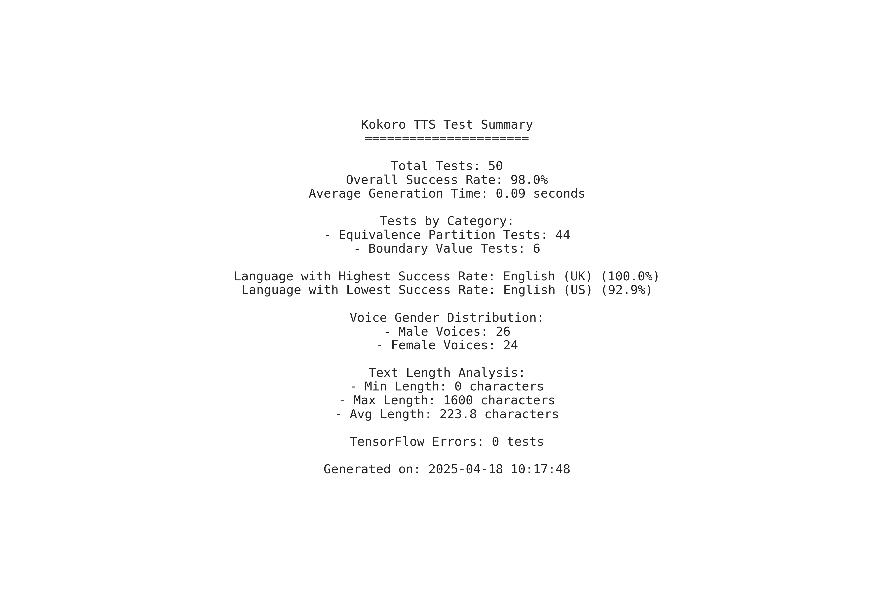

# Kokoro TTS Validation Project
This project provides a comprehensive validation framework for testing the Kokoro Text-to-Speech (TTS) system. It includes a web application for interacting with Kokoro TTS and a robust automated testing suite that implements modern testing techniques such as Equivalence Partitioning and Boundary Value Analysis.

## Overview
The validation framework consists of:
1. **Web Application (`app.py`)**: A Flask application that provides a user interface for the Kokoro TTS system
2. **Test Automation (`kokoro_test_automation.py`)**: A Python script using Selenium for automated testing
3. **Testing Methodology**: Implementation of Equivalence Partitioning and Boundary Value Analysis
4. **Visualization**: Automatic generation of test result visualizations

## Prerequisites
- Python 3.8+
- Chrome browser (for Selenium tests)
- ChromeDriver compatible with your Chrome version
- Kokoro TTS library (installed via requirements.txt)
- TensorFlow and PyTorch for the speech synthesis engine

## Installation
### Clone the Repository
```bash
git clone https://github.com/g-hano/validation-project.git
cd validation-project
```
### Setup Virtual Environment and Install Dependencies
```bash
# Create a virtual environment
python -m venv venv

# Activate virtual environment
# On Windows:
venv\Scripts\activate
# On macOS/Linux:
source venv/bin/activate

# Install dependencies
pip install -r requirements.txt
```

## Project Setup History
This project was set up with the following commands:
```bash
git init
git config --global user.email "mcihann19@hotmail.com"
git config --global user.name "Cihan Yalçın"
git remote add origin https://github.com/g-hano/validation-project.git
git checkout -b main
git add .
git commit -m "Initial commit: Add Kokoro TTS testing framework"
git push -u origin main
git checkout -b feature/add-documentation
```

## Running the Application
### Start the Web Application
The web application needs to be running for the tests to work:
```bash
python app.py
```
This will start the Flask web server at `http://localhost:5000`. You can access the web interface in your browser.


### Running the Test Automation
To run the automated tests, use the following command in a separate terminal (make sure the web application is running):
```bash
python kokoro_test_automation.py
```

### Test Options
The test automation script supports various command-line options:
```bash
# Run tests with a visible browser (not headless)
python kokoro_test_automation.py --visible

# Set custom timeout (in seconds)
python kokoro_test_automation.py --timeout 180

# Run only boundary value tests
python kokoro_test_automation.py --only-boundary

# Run only equivalence partitioning tests
python kokoro_test_automation.py --only-partitioning

# Do not randomize test order
python kokoro_test_automation.py --no-random

# Specify custom output directory
python kokoro_test_automation.py --output-dir my_test_results

# Enable screenshots during test execution
python kokoro_test_automation.py --screenshots

# Run tests against a different host
python kokoro_test_automation.py --url http://example.com
```
You can combine multiple options:
```bash
python kokoro_test_automation.py --visible --only-boundary --timeout 180
```

## Supported Voices and Languages

The Kokoro TTS system supports multiple languages and voices. Here's a breakdown:

### English (US)
- **Female voices**: Nicole, Jessica, River, Alloy, Heart, Bella, Aoede, Sky, Nova, Sarah, Kore
- **Male voices**: Fenrir, Eric, Adam, Onyx, Santa, Puck, Echo, Michael, Liam

### English (UK)
- **Female voices**: Alice, Lily, Emma, Isabella
- **Male voices**: George, Fable, Lewis, Daniel

### Spanish
- **Female voices**: Dora
- **Male voices**: Alex, Santa

### French
- **Female voices**: Siwis

### Italian
- **Female voices**: Sara
- **Male voices**: Nicola

### Portuguese (Brazil)
- **Female voices**: Dora
- **Male voices**: Alex, Santa

## Testing Methodology

### Equivalence Partitioning
The test automation partitions the input domain into classes where the behavior of the system is expected to be similar:
- **Language Families**: European languages (English, Spanish, French, etc.)
- **Voice Genders**: Male vs. Female voices
- **Text Lengths**: Short, Medium, Long text inputs

### Boundary Value Analysis
Tests are designed to evaluate boundary conditions:
- **Empty Text**: Testing with empty input
- **Single Character**: Testing with minimal valid input
- **Very Long Text**: Testing with inputs approaching length limits
- **Special Characters**: Testing with non-alphanumeric inputs
- **Numbers Only**: Testing with numeric-only inputs
- **Mixed Extremes**: Testing with a combination of boundary values

## Technical Implementation

### Web Application Architecture
The Flask web application (`app.py`) serves as a frontend to the Kokoro TTS system:

1. **Server-Side Components**:
   - Flask routes for handling HTTP requests
   - Kokoro TTS integration through KPipeline
   - Dynamic voice selection based on language
   - Audio file generation and serving

2. **Client-Side Components**:
   - Language and voice selection UI
   - Text input area
   - Speech generation triggering
   - Audio playback interface
   - Error handling and status updates

### Test Automation Architecture
The test automation script (`kokoro_test_automation.py`) implements a robust testing framework:

1. **WebDriver Initialization**:
   - Chrome browser automation via Selenium
   - Configurable headless mode
   - Custom timeout settings

2. **Test Case Generation**:
   - Dynamic test case building based on available voices
   - Randomization options for test order
   - Parameterized test inputs for different scenarios

3. **Test Execution**:
   - Robust element waiting and interaction
   - Screenshot capture on failures
   - Browser log analysis
   - Test case retry mechanisms

4. **Results Processing**:
   - JSON result storage
   - Statistical analysis
   - Visualization generation
   - Test summary reports

## Test Results and Visualizations

After running the tests, various visualizations are generated in the `test_results` directory. Here are examples of the visualizations you can expect:

### Generation Time by Language



This chart shows the average time it takes to generate speech for each language. Languages with more complex phonetics or longer processing times will show higher bars.

### Success Rate by Language


This visualization displays the percentage of successful speech generation attempts by language. It helps identify which languages might have reliability issues.

### Text Length vs. Generation Time


This scatter plot with a regression line shows the relationship between text length (characters) and generation time. A steeper slope indicates that generation time increases more rapidly with text length.

### Generation Time by Voice Gender



This comparison shows whether male or female voices have different processing times, which can help identify performance patterns across voice types.

### Success Rate for Boundary Tests


This chart shows how the system performs with edge cases like empty text, special characters, and extremely long inputs. Lower success rates indicate potential weak points in the system.

### Test Summary



This text-based visualization provides an overall summary of test results, including total tests run, success rates, and key performance metrics.

## Test Screenshots

During test execution, especially when errors occur, the test automation can capture screenshots to help diagnose issues. Here are examples of screenshots you might see in the `test_screenshots` directory:

### Successful Text-to-Speech Generation

_bf_alice_20250418_101245.png)

A screenshot showing successful generation of speech with the audio player visible.

## Output Files
Test results are saved in the `test_results` directory (or the custom directory specified with `--output-dir`):
- **JSON Results**: Detailed test results in JSON format
- **Visualizations**: Generated charts showing test performance
- **Screenshots**: (If enabled) Screenshots captured during test failures

## Project Structure
```
validation-project/
├── app.py                     # Flask web application
├── kokoro_test_automation.py  # Automated test script
├── requirements.txt           # Python dependencies
├── static/                    # Static files for web app
│   └── css/
│       └── style.css          # CSS styles
├── templates/                 # HTML templates
│   └── index.html             # Main web interface
├── output/                    # Generated audio files
├── test_screenshots/          # Screenshots captured during test execution
└── test_results/              # Test results and visualizations
    ├── *.json                 # Test result data
    └── *.png                  # Generated charts
```